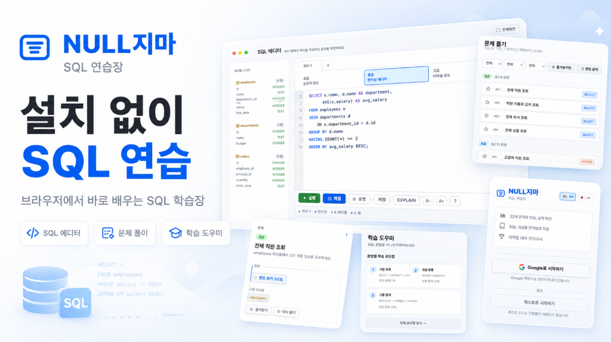
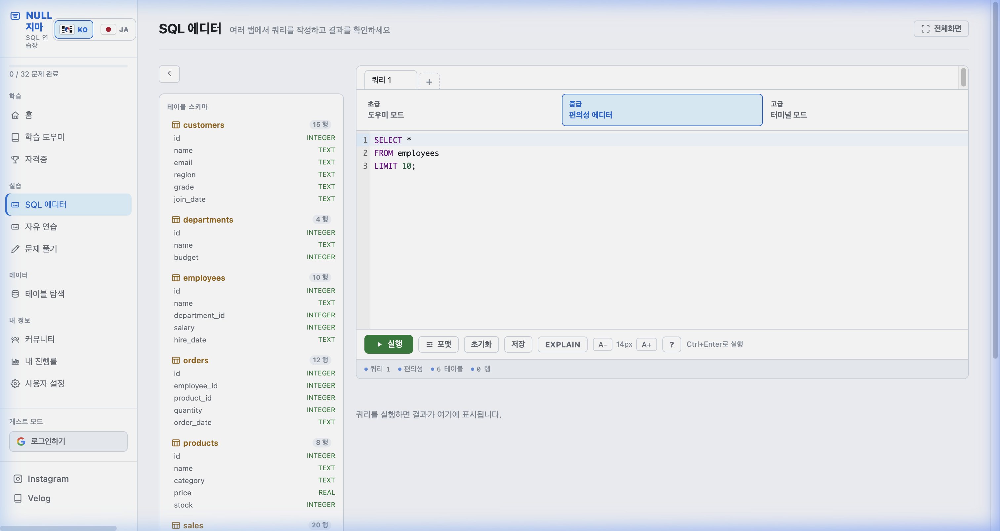

# NULL지마

실무형 샘플 데이터로 SQL을 배우고, 직접 실행하고, 문제를 풀어볼 수 있는 SQL 학습 웹앱입니다.





## 주요 기능

- SQL 전용 에디터
  - 초급 도우미 모드: 문법 골격 선택
  - 중급 편의성 에디터: 자동완성, 포맷, 스키마 참고
  - 고급 터미널 모드: 콘솔형 실행 환경
- 자유 연습
  - SQL 실행 결과 확인
  - 테이블 스키마 탐색
  - 예제 쿼리 제공
- 문제 풀이
  - 단계별 힌트
  - 정답 채점
  - 오답 원인 분석
  - 최근 작성 SQL 자동 저장
  - 즐겨찾기 / 다시 풀기 표시
- 학습 도우미
  - SELECT, WHERE, ORDER BY, GROUP BY, JOIN, 서브쿼리 학습
  - 문법별 로드맵
- 테이블 탐색
  - 테이블 컬럼 확인
  - 샘플 데이터 조회
  - ERD 관계도
- 커뮤니티 게시판
  - 질문, 풀이 공유, 팁, 자유 글 작성
  - 댓글과 추천
- 사용자 설정
  - 학습 목표, 에디터 옵션, DB 종류 선택
  - Oracle은 준비중 상태로 표시
- 반응형 UI
  - 데스크톱 사이드바 레이아웃
  - 모바일 하단 탭 레이아웃

## 기술 스택

- React
- Vite
- sql.js
- CodeMirror
- Firebase
- ESLint

## 실행 방법

```bash
npm install
npm run dev
```

개발 서버가 실행되면 아래 주소로 접속합니다.

```text
http://localhost:5173
```

## 빌드

```bash
npm run build
```

## 검사

```bash
npm run lint
```

## 프로젝트 구조

```text
src/
  components/   공통 UI 컴포넌트
  contexts/     인증 컨텍스트
  data/         학습 콘텐츠와 문제 데이터
  lib/          DB, 채점, 진행률, 설정 유틸
  pages/        라우트 페이지
public/         정적 리소스
docs/images/    README 이미지
```

## 레포지터리

[donghyuk0605/null-jima](https://github.com/donghyuk0605/null-jima)

## 소셜 링크

- **Instagram**: [donghyuk65](https://www.instagram.com/donghyuk65)
- **Velog**: [@donghyuk65](https://velog.io/@donghyuk65)
